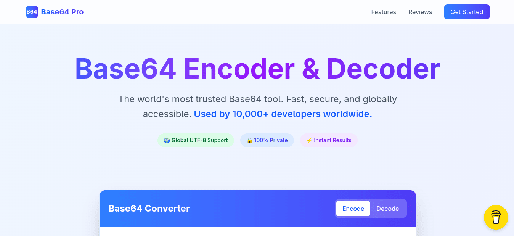

# 🔐 Base64 Pro - Advanced Encoder/Decoder

A powerful, modern Base64 encoder/decoder built with **Next.js 14**, **TypeScript**, and **Tailwind CSS**. Convert text to Base64 and decode Base64 back to text with real-time conversion, file support, and a beautiful user interface.

## ✨ Features

- 🚀 **Real-time Conversion** - Instantly encode/decode as you type
- 🔄 **Bidirectional** - Switch between encode and decode modes seamlessly
- 📁 **File Support** - Upload text files for bulk operations
- 📋 **Copy to Clipboard** - One-click copying with visual feedback
- 💾 **Download Results** - Save converted text as files
- 🔒 **Privacy First** - All processing done locally, no server uploads
- 📱 **Fully Responsive** - Perfect on all devices and screen sizes
- ⚡ **Lightning Fast** - Optimized performance with Next.js 14
- 🎨 **Modern UI** - Beautiful gradients and smooth animations
- 🔧 **Developer Friendly** - Built for API testing and development workflows

## 🖥️ Live Demo

Visit the live demo: [base64-pro.codinasion.com](https://base64-pro.codinasion.com)

---

Made with ❤️ by <a href="https://www.codinasion.com">Codinasion</a>

